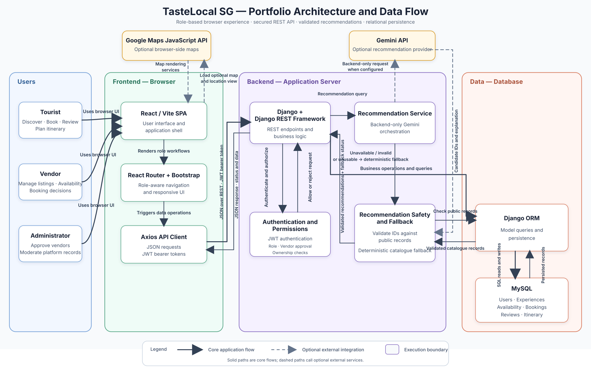
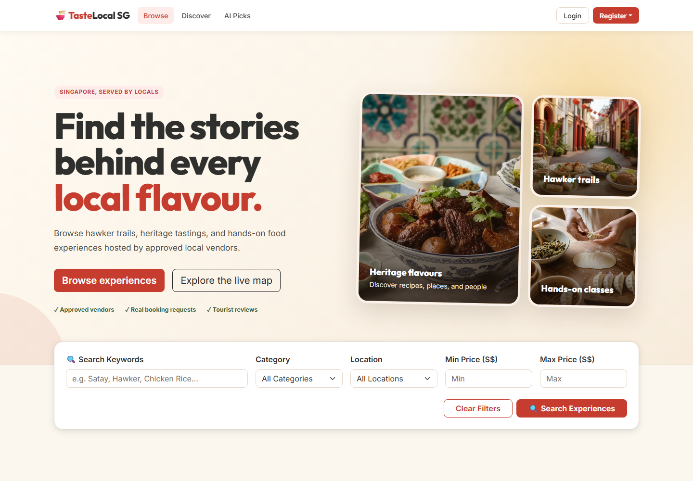
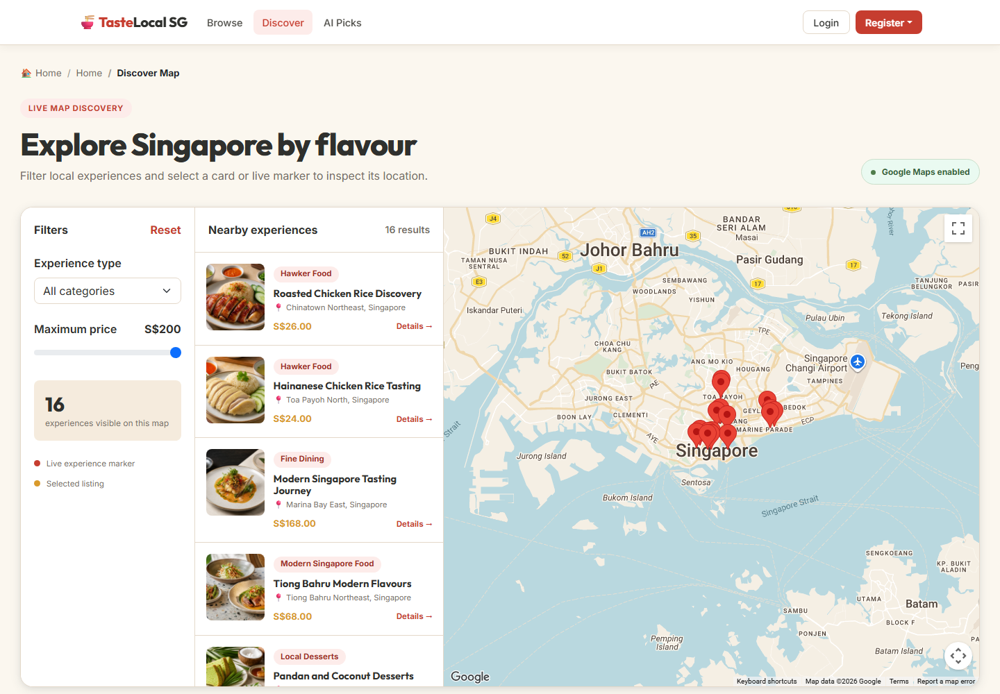
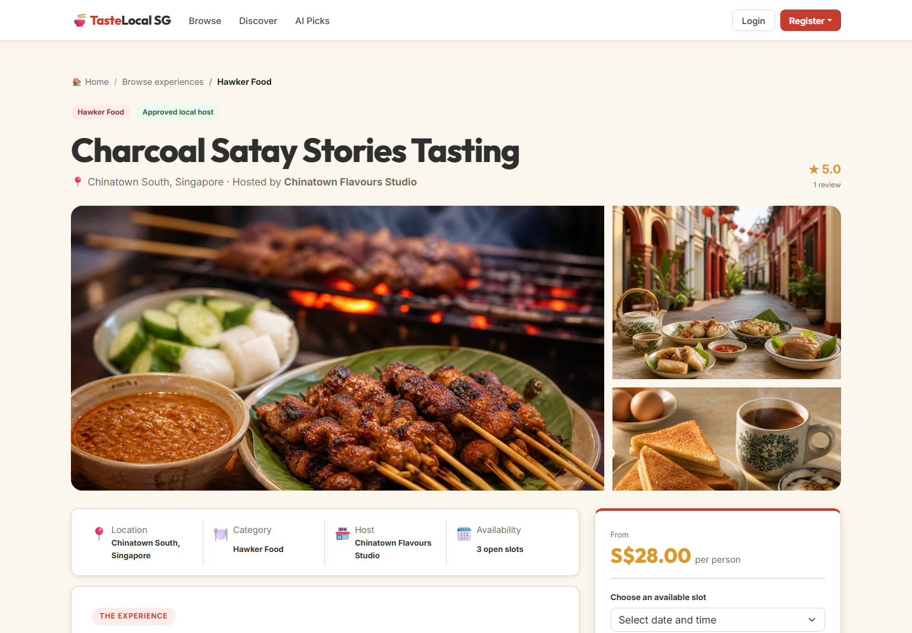
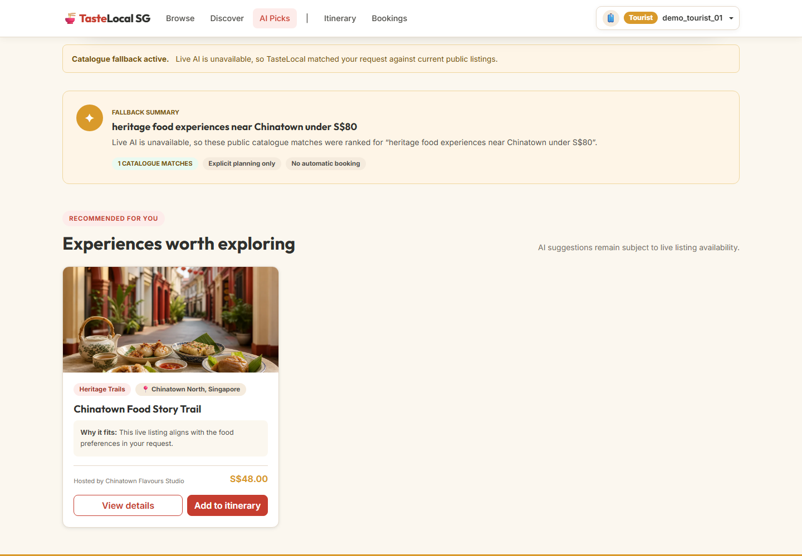
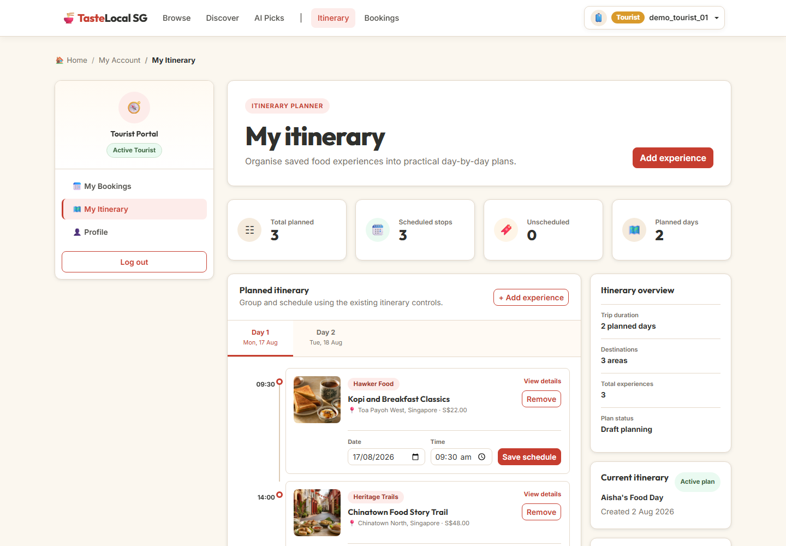
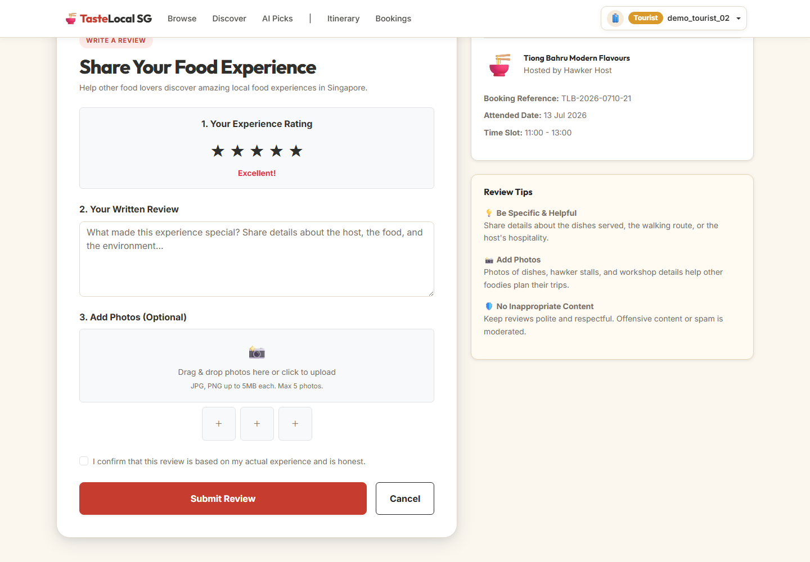
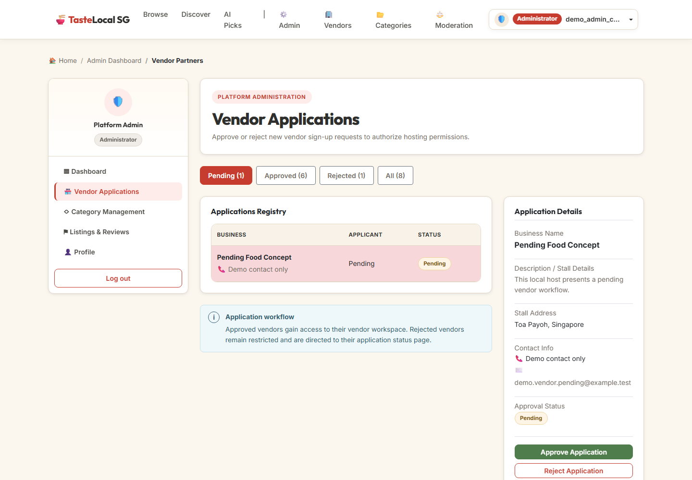

# TasteLocal SG

TasteLocal SG is a full-stack Singapore food-tourism platform that helps **Tourists** discover and plan local experiences, **Vendors** manage listings and booking requests, and **Administrators** moderate platform operations.

Built with **React**, **Django REST Framework**, and **MySQL**, the project covers booking workflows, itinerary planning, optional Google Maps discovery, and Gemini-assisted recommendations with a deterministic fallback. The verified backend suite passes **101 tests**, and the frontend installation, production build, lint, and development startup checks all pass.

> Portfolio project · Three role-based workflows · 101/101 backend tests passed · Frontend build verified

## Portfolio Highlights

- **End-to-end role workflows:** Tourist discovery, booking, reviews, and itinerary planning; Vendor listing, availability, and booking management; Administrator approval and moderation tools.
- **Full-stack architecture:** React/Vite single-page application, Django REST Framework API, MySQL persistence, JWT authentication, and role/ownership enforcement.
- **Resilient integrations:** Optional Google Maps interface with a non-map fallback, plus backend-only Gemini recommendations grounded in public catalogue records with a deterministic fallback.
- **Verified implementation:** Django system check passed, 101 backend tests passed, and frontend clean installation, production build, lint, and startup checks passed.
- **Publication safety:** Environment templates contain placeholders, local secrets and generated files are ignored, and controlled image provenance is documented.

## Table of Contents

- [Portfolio Status](#portfolio-status)
- [Problem and Intended Users](#problem-and-intended-users)
- [Main Features](#main-features)
- [User Roles](#user-roles)
- [Technology Stack](#technology-stack)
- [System Architecture](#system-architecture)
- [Project Structure](#project-structure)
- [Local Setup](#local-setup)
- [Environment Variables](#environment-variables)
- [Database and Controlled Demo Data](#database-and-controlled-demo-data)
- [API Overview](#api-overview)
- [Testing and Verification](#testing-and-verification)
- [External Integrations and Fallbacks](#external-integrations-and-fallbacks)
- [Known Limitations](#known-limitations)
- [AI-Assisted Development Disclosure](#ai-assisted-development-disclosure)
- [Screenshots and Demo](#screenshots-and-demo)
- [Licence](#licence)
- [Contact](#contact)

## Portfolio Status

TasteLocal SG is a portfolio-ready local demonstration project. Its source is published in the [TasteLocal SG GitHub repository](https://github.com/derekwongha/tastelocal-sg). Curated screenshots are included below, and a short local demo video is planned as a separate presentation asset.

The Django/MySQL application is not publicly deployed. Production deployment is not required for this portfolio project.

## Problem and Intended Users

Food-focused visitors need a simple way to find and organize local experiences, while independent hosts need a focused workflow for publishing availability and responding to booking requests. TasteLocal SG explores that workflow through three roles:

- **Tourists** discover, request, review, and plan food experiences.
- **Vendors** manage experiences and booking operations after administrator approval.
- **Administrators** moderate the platform's operational records.

The project uses controlled synthetic data for demonstration. It does not claim real customers, commercial vendors, or live business use.

## Main Features

- Tourist and Vendor registration, JWT login, token refresh, logout, and profile access.
- Public browsing of published food experiences.
- Keyword, category, location, and price filtering.
- Experience details with descriptions, location data, availability, and reviews.
- Tourist booking requests and cancellations.
- Vendor approval, rejection, cancellation, and completion of booking requests.
- Vendor availability and timeslot management.
- Vendor dashboard and owned-listing management.
- Reviews restricted to eligible completed experiences.
- Single-itinerary planning with scheduling and removal of stops.
- Administrative vendor approval, category management, listing moderation, review moderation, and user visibility.
- Optional Google Maps discovery with a non-map fallback.
- Gemini-assisted recommendations grounded in public experience records, with a deterministic local fallback.

There is no payment gateway, checkout, or financial transaction workflow.

## User Roles

| Role | Main access |
|---|---|
| Tourist | Browse public experiences, submit booking requests, review eligible completed experiences, and manage one itinerary |
| Vendor | Register for approval; once approved, manage owned listings, availability, and booking decisions |
| Administrator | Manage vendor approvals, categories, listings, reviews, and users |

Backend permissions enforce authentication, role, Vendor approval status, and record ownership where applicable. Frontend route controls support the user experience but are not treated as the security boundary.

## Technology Stack

Backend versions were verified in the current copied workspace on 31 July 2026. Frontend versions were verified through a clean installation in the current copied workspace on 1 August 2026.

### Backend

| Component | Version or technology |
|---|---|
| Python | 3.11.1 |
| Django | 4.2.30 |
| Django REST Framework | 3.17.1 |
| Authentication | SimpleJWT 5.5.1, with temporary legacy DRF TokenAuthentication compatibility |
| Database | MySQL 8 through `mysqlclient` 2.2.8 |
| Configuration | `python-dotenv` 1.2.2 |
| Cross-origin support | `django-cors-headers` 4.9.0 |

### Frontend

| Component | Version or technology |
|---|---|
| React | 19.2.7 |
| React DOM | 19.2.7 |
| React Router DOM | 7.18.1 |
| Vite | 8.1.3 |
| Axios | 1.18.1 |
| Bootstrap | 5.3.8 |
| Popper | 2.11.8 |
| Linting | Oxlint 1.73.0 |

### Integrations

- Google Maps JavaScript API.
- Gemini using the current `gemini-2.5-flash` model.

## System Architecture

The following diagram presents the main recruiter-facing architecture and data flow across users, the browser frontend, backend services, optional integrations, and persistence.



```text
Browser
├── React/Vite SPA
│   └── Google Maps JavaScript API (optional, browser-side)
│
│ JSON over REST
▼
Django REST Framework
├── authentication, role, approval, and ownership checks
├── backend-only Gemini request (optional)
├── public-record validation of recommended experience IDs
└── deterministic recommendation fallback
│
│ Django ORM
▼
MySQL
```

The React single-page application calls the Django REST API over JSON. Django applies access rules and persists relational data through the ORM. Google Maps runs in the browser when configured. Gemini is called only by the backend; returned identifiers are checked against public database records before a response is built. If Gemini is unavailable or unconfigured, the backend returns deterministic catalogue-based recommendations and identifies the fallback state.

## Project Structure

```text
TasteLocalSG/
├── .gitignore
├── README.md
├── backend/
│   ├── .env.example
│   ├── manage.py
│   ├── requirements.txt
│   ├── config/                    # Django settings and root routing
│   └── apps/
│       ├── accounts/             # Users, JWT flows, profiles, permissions
│       ├── administration/       # Administrative APIs
│       ├── bookings/             # Booking request lifecycle
│       ├── experiences/          # Catalogue, availability, Maps data, recommendations
│       ├── itinerary/            # Tourist itinerary planning
│       ├── reviews/               # Eligible review submission
│       └── vendors/               # Vendor profiles and approval state
└── frontend/
    ├── .env.example
    ├── .gitignore
    ├── .oxlintrc.json
    ├── index.html
    ├── package.json
    ├── package-lock.json
    ├── public/
    │   └── demo-images/
    │       └── experiences/       # Controlled local WebP images
    └── src/
        ├── api/
        ├── components/
        ├── context/
        ├── pages/
        ├── routes/
        ├── utils/
        ├── App.jsx
        └── main.jsx
```

Internal audits, raw evidence, testing chronology, generated dependencies, builds, caches, and local environments are not part of the intended public repository.

## Local Setup

These instructions describe the verified local setup path. In the copied portfolio workspace, the Django system check and all 101 backend tests passed, while the frontend clean installation, production build, lint, and development startup checks also passed. The application remains intended for local demonstration rather than public deployment.

### Prerequisites

- Python 3.11.
- Node.js compatible with Vite 8.
- MySQL 8.

### Backend

From the project root:

```powershell
cd backend
python -m venv .venv
.\.venv\Scripts\Activate.ps1
python -m pip install -r requirements.txt
Copy-Item .env.example .env
```

For macOS or Linux, activate the environment with:

```bash
source .venv/bin/activate
```

Edit `backend/.env` with local values. Create a local MySQL database using a database name and account that match those values. Do not place real credentials in source or documentation.

Then initialize the schema and, where needed, an Administrator account:

```powershell
python manage.py migrate
python manage.py createsuperuser
```

Preview the controlled synthetic dataset before applying it:

```powershell
python manage.py seed_demo_data --dry-run
python manage.py seed_demo_data
```

The seed command requests its demo-account password at runtime. Do not store that password in the repository, environment example, screenshots, or documentation.

Start Django locally:

```powershell
python manage.py runserver
```

### Frontend

In a second terminal, from the project root:

```powershell
cd frontend
npm ci
Copy-Item .env.example .env
npm run dev
```

The frontend example points to the local backend API. A Google Maps key may be added to the local `.env`; it is optional because the UI provides fallback behavior.

## Environment Variables

Copy each `.env.example` file to `.env` in the same directory. Real `.env` files are local-only and ignored.

### Backend

| Variable | Purpose |
|---|---|
| `SECRET_KEY` | Unique local Django cryptographic secret |
| `DEBUG` | Local Django debug setting |
| `ALLOWED_HOSTS` | Comma-separated allowed hostnames |
| `DB_NAME` | Local MySQL database name |
| `DB_USER` | Local MySQL user |
| `DB_PASSWORD` | Local MySQL password |
| `DB_HOST` | MySQL host |
| `DB_PORT` | MySQL port |
| `CORS_ALLOWED_ORIGINS` | Allowed local frontend origins |
| `GEMINI_API_KEY` | Optional backend-only Gemini key |

### Frontend

| Variable | Purpose |
|---|---|
| `VITE_API_URL` | Local backend API base; the example uses `http://localhost:8000/api` |
| `VITE_GOOGLE_MAPS_API_KEY` | Optional browser-side Google Maps key |

No Gemini model environment variable is used by the current source. If Gemini is not configured, recommendations use the deterministic fallback. If Google Maps is not configured or cannot load, the application retains non-map discovery and fallback messaging.

## Database and Controlled Demo Data

TasteLocal SG uses MySQL 8 through the Django ORM and source-controlled Django migrations.

The recommended public setup path is the `seed_demo_data` management command. It creates a controlled synthetic demonstration dataset and maps its experiences to local WebP assets under `frontend/public/demo-images/experiences/`. The command supports a dry run and obtains its demo password at runtime rather than storing it in source.

No demo usernames, passwords, email addresses, physical addresses, or contact numbers are documented here.

## API Overview

All application endpoints are under `/api/`. Representative routes include:

| Access | Method and path | Purpose |
|---|---|---|
| Public | `GET /api/experiences/public/` | List published experiences |
| Public | `GET /api/experiences/public/<id>/` | Retrieve one public experience |
| Public | `GET /api/experiences/categories/` | List categories |
| Public | `GET /api/experiences/locations/` | List locations |
| Public | `POST /api/experiences/recommendations/` | Gemini-assisted or deterministic recommendations |
| Authenticated | `/api/accounts/` | Registration, login, refresh, logout, and profile operations |
| Tourist | `/api/bookings/` | Own booking requests and cancellation |
| Tourist | `/api/itinerary/` | Own itinerary and itinerary items |
| Tourist | `POST /api/reviews/` | Eligible review submission |
| Approved Vendor | `/api/experiences/vendor/` | Owned listing management |
| Approved Vendor | `POST /api/experiences/vendor/timeslots/` | Create availability; `food_experience` is supplied in the request payload |
| Approved Vendor | `/api/bookings/vendor/` | Booking decisions for owned experiences |
| Administrator | `/api/administration/` | Vendor, category, listing, review, and user administration |

Public catalogue filters are:

- `q`
- `category`
- `location`
- `min_price`
- `max_price`

The recommendation endpoint is public. It limits its source set to publicly visible experiences and validates provider-returned identifiers against those database records. A fallback response is not presented as live provider output.

Authenticated routes additionally enforce the relevant role, Vendor approval, and ownership boundaries.

## Testing and Verification

Current copied-workspace backend verification on 1 August 2026 recorded:

- Django system check: passed with no issues.
- Backend tests: 101 discovered and 101 passed in 75.494 seconds, with 0 failures, 0 errors, and 0 skipped tests reported.
- The suite ran against Django's temporary MySQL test database, which was created and destroyed normally.

Current copied-workspace frontend verification on 1 August 2026 recorded:

- Dependency remediation: the transitive PostCSS resolution was updated from affected version 8.5.16 to patched version 8.5.25 within Vite's existing compatible range. No direct PostCSS dependency or package override was added, and React Router remained at 7.18.1.
- Clean installation: `npm ci` completed successfully from the patched lockfile.
- Dependency audit: the PostCSS/Vite findings were cleared. Two high-severity package entries remain for the documented React Router unstable-RSC advisory; this client-rendered SPA does not use the affected RSC APIs, and its correction requires a separately approved major migration.
- Frontend production build: succeeded using Vite 8.1.3, with 123 modules transformed in 492 ms. The generated JavaScript chunk triggered one size warning.
- Frontend lint: passed with 0 errors and one `react(only-export-components)` warning in `src/context/AuthContext.jsx`.
- Development startup: the config-free Vite server became ready at `http://127.0.0.1:5188/` in 193 ms and was stopped after the check.

The backend test suite covers application models, API behavior, access rules, workflow transitions, recommendation fallbacks, provider-response handling, and controlled seed behavior. No frontend automated test suite currently exists.

Full internal testing chronology is intentionally not published here.

## External Integrations and Fallbacks

### Google Maps

Google Maps is loaded in the browser using the optional `VITE_GOOGLE_MAPS_API_KEY`. When the key is absent or Maps cannot load, users can continue using the standard catalogue and the interface displays fallback messaging. The service is not claimed to be continuously available.

### Gemini recommendations

Gemini is called from the Django backend using the optional `GEMINI_API_KEY`; the key is not sent to the frontend. The current source calls `gemini-2.5-flash`. Recommended experience IDs are checked against publicly visible database records before they are returned.

When Gemini is unavailable, unconfigured, times out, or returns unusable data, the endpoint uses a deterministic catalogue-based fallback and identifies that state. Fallback output is not described as live Gemini output.

## Known Limitations

- The application is intended for local demonstration and is not publicly deployed.
- No payment processing or checkout is implemented.
- Registration has no email verification workflow.
- No forgot-password or email password-reset workflow is implemented.
- The review page has no actual review-photo upload backend or storage workflow.
- JWT access and refresh tokens are stored in browser `localStorage` within the current frontend architecture.
- Temporary legacy DRF TokenAuthentication compatibility remains alongside SimpleJWT.
- Each Tourist has one itinerary rather than multiple named itineraries.
- There is no frontend automated test suite.
- Maps and Gemini behavior depends on optional external configuration and provider availability; both have fallback behavior.
- Public deployment configuration and production hardening are outside the current portfolio scope.

## AI-Assisted Development Disclosure

The project owner defined and refined the requirements, planned the user workflows and design, and directed the implementation. Codex and Antigravity were used to assist with implementation, review, debugging, documentation, and iterative refinement.

The owner reviewed generated outputs, tested functionality, resolved issues through repeated verification, and prepared the project documentation and presentation. AI accelerated parts of the work; it did not replace human direction, technical decisions, validation, or ownership. The owner can explain the architecture, features, implementation decisions, testing approach, and known limitations.

The project does not claim that every line was written manually.

## Screenshots and Demo

The gallery highlights the core public, Tourist, and Administrator workflows using controlled synthetic demonstration data.



**Public discovery and catalogue search**



**Live Google Maps catalogue discovery**



**Experience details and future availability**



**Deterministic catalogue fallback when live Gemini is unavailable**



**Tourist itinerary planning**



**Tourist review submission for an eligible completed booking**



**Administrator vendor approval workflow**

The complete screenshot set also covers filtered search results, Tourist booking requests, the Vendor dashboard, Vendor booking management, and Vendor availability management.

A planned 3–5 minute local demo video will cover the Tourist, Vendor, and Administrator workflows.

## Licence

The source code is released under the MIT Licence. See the [`LICENSE`](LICENSE) file for the full terms. Project media and assets are subject to the provenance notes in [`docs/ASSET_PROVENANCE.md`](docs/ASSET_PROVENANCE.md).

## Contact

Project source: [github.com/derekwongha/tastelocal-sg](https://github.com/derekwongha/tastelocal-sg)

Professional contact details will be provided through the portfolio website.
